# Body-Fitted-Grid-Generation-for-Elliptic-domain
Introduction
============

This is a **2D elliptic mesh (grid) generator** which works by solving
the partial differential equations. This algorithm works by calculating
curve slopes using a tilted parabola tangent line fitter. The mesh
generator is packaged as a Java program which can be compiled and
executed via Eclipse Java IDE.The program allows one to the following
parameters for the fluid domain: major axis length, minor axis length,
x-resolution, y-resolution, center of the puncture circle and the radius
of the puncture circle.

Mathematical Framework
======================

The algorithms implemented in this project are mainly founded upon the
principles of differential geometry and tensor calculus. The most
fundamental concept behind the mathematics governing this project is the
transition between coordinate systems in order to obtain the solution to
partial differential equations in the most efficient manner possible.
More specifically, in the context of this project, this implies
transforming a set of equations written in Cartesian coordinates to
curvilinear coordinates. This concept can be extended to any number of
spatial dimensions, which will later be shown. However, a
two-dimensional solution was developed in order to demonstrate the
feasibility of generating smooth elliptic grids with the prescribed
specifications.\

Consider a system of *n* dimensions which can be represented by the set
of Cartesian coordinates

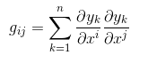 

where each of the partial derivatives comes from the definition of the
covariant base vectors. Each of these base vectors describe how one
coordinate system changes with respect to another, when any particular
coordinate is held fixed. For our two-dimensional problem, we can expand
these sums to yield the following expressions for the metric tensors.\

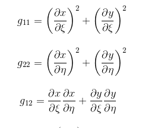

Elliptic Mesh Generation Algorithm
==================================

To construct an initial mesh, the Transfinite Interpolation algorithm is
applied to the given domain constrained by the specified boundary
conditions. This algorithm is implemented by mapping each point within
the domain (regardless of the boundaries) to a new domain existing
within the boundaries. This algorithm works by iteratively solving the
parametric vector equation.

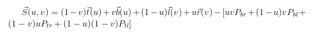

where and represent parameters in the original domain and $\vec{l}$,
$\vec{t}$, $\vec{b}$ and $\vec{r}$ represent the curves defining the
left, top, bottom and right boundaries. $P_{ij}$ represents the point of
intersection between curve and $\vec{i}$, $\vec{j}$\

At the heart of the solver is the mesh smoothing algorithm, which at a
high level, works by solving the pair of Laplace equations\

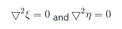

where $\xi$ and $\eta$ represent the x and y coordinates of every point
in the target domain, mapped to a transformed, computational space using
the change of variables method. This renders the calculations simpler
and faster to compute. However, we wish to solve the inverse problem,
where we transition from the computational space to the curvilinear
solution space. Using tensor mathematics, it can be shown that this
problem entails solving the equations.\

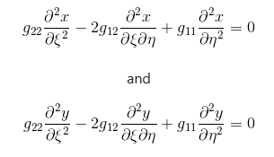

where $g_{ij}$ is the covariant metric tensor at entry (i,j) within the
matrix of covariant tensor components defining the mapping of the
computational space coordinates $(\xi,\eta)$ onto the physical solution
space coordinates (x,y). In this model, x and y are computed as
functions of $\xi$ and $\eta$ .

This set of equations are the elliptic PDEs known as the Winslow
equations. These are applied to the mesh using the method of mixed-order
finite differences on the partial derivatives (and tensor coefficients,
as they are a function of these derivatives), thereby resulting in the
equations (for a single node):

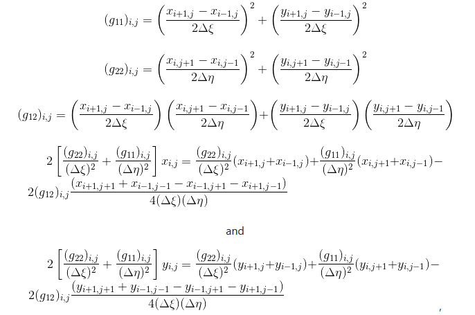

where i and j are the coordinates of a node in the mesh in computational
space. Here $\Delta \xi$and $\Delta \eta$ are equal increments in $\xi$
and $\eta$ respectively.

The coefficients for these equations can be generated for each point to
form a system of linear equations, which is then modeled in matrix
representation, resulting in a tri-diagonal matrix. This matrix is then
solved iteratively using the **Thomas Tri-Diagonal Matrix Algorithm**
line-by-line by traversing from the bottom up.

Mesh Quality Analysis
=====================

In order to determine the quality of the resulting mesh, it was
necessary to construct an objective means of quality measurement.
Therefore, several statistical procedures were implemented in the
program to produce a meaningful mesh quality analysis report. The
metrics which are presented are divided into the following categories:

-   Orthogonality Metrics

    -   Standard deviation of angles

    -   Mean angle

    -   Maximum deviation from 90 degrees

    -   Percentage of angles within x degrees from 90 degrees (x can be
        set as a constant in the code)

-   Cell Quality Metrics

    -   Average aspect ratio of all cells

    -   Standard deviation of all aspect ratios

Here, “angle” refers to the angle of intersection of grid lines at a
node and “aspect ratio” refers to the skewness of a grid cell measured
as a ratio of the cell’s longest side to its shortest side.

Code structure
==============

The following shows the code structure in the Eclipse Java IDE.The
program is written in a modular way, allowing it to be altered for new
boundary cases.

-   EllipticMeshGenerator2D.java

    -   This is the main program.

-   MeshHelper.java

    -   Class containing helper methods for setting up the visualized
        meshes at different stages throughout the generation process

-   MeshSolver.java

    -   Class containing methods which perform the main algorithmic
        computations throughout the mesh generation process

-   MeshStatistics.java

    -   Class for analyzing the quality of the generated meshes and
        reporting key statistics

-   TiltedParabolaFitter.java

    -   Class which curve fits a set of three points with a parabola at
        an angle theta such that the middle point

-   GifSequenceWriter.java

    -   Creates a new GifSequenceWriter

Mathematical libraries like **JMathPlot**(as **org.jar** here) as
Referenced libraries for plotting and for numerical computation.

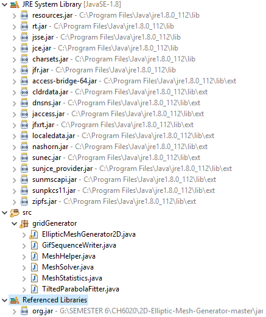

Results and Discussions
=======================

Here as the given domain was horizontally symmetric, only the top half
of the domain is concerned for solving the problem. Since only three
smooth boundaries are present, a split point has to be chosen, so as to
create the four boundaries. This point is generally at $x = a/2$ where
*a* is the semi-major axis length.

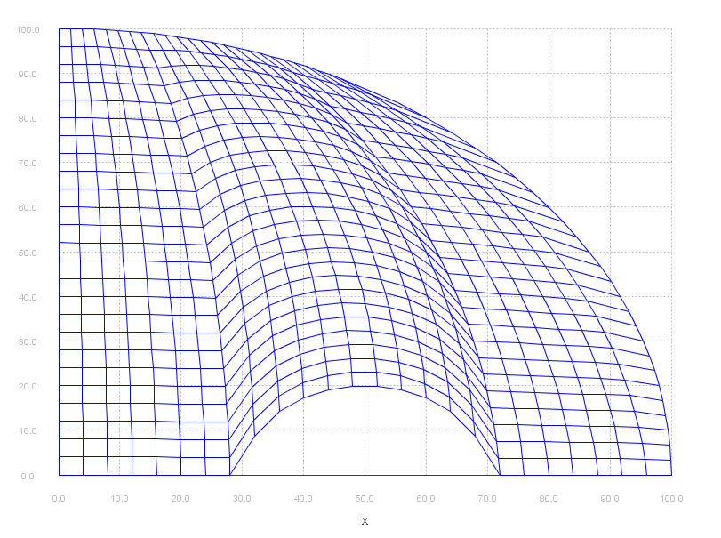

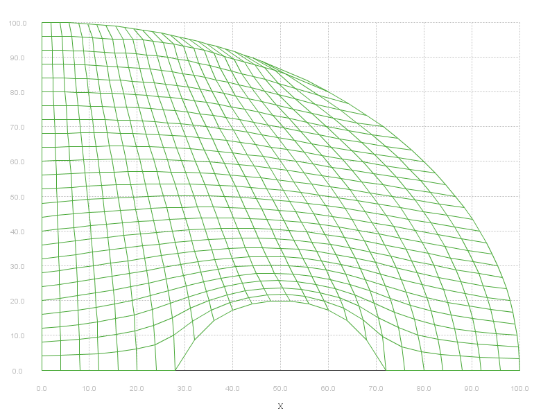

Mesh Quality report for 4 X 4 resolution
----------------------------------------

-   Initial (Transfinite interpolation)

    -   Boundary Angles

        -   The standard deviation of all boundary angles is:
            2.412145192252833$^{\circ}$

        -   The mean boundary angle is: 94.69510733620636$^{\circ}$

        -   The maximum deviation of all angles from 90$^{\circ}$ on the
            boundary is: 56.867308795456815$^{\circ}$

        -   The corresponding angle is: 33.132691204543185$^{\circ}$ and
            is located at position: [0, 8]

        -   The percent of angles within 10$^{\circ}$ of 90$^{\circ}$ on
            the boundary is: 56.25 %

    -   Interior angles

        -   The standard deviation of all interior angles is:
            1.0413714606748834$^{\circ}$

        -   The mean interior angle is: 92.12785308218719$^{\circ}$

        -   The maximum deviation of all angles from 90$^{\circ}$ on the
            interior is: 55.89652205783994$^{\circ}$

        -   The corresponding angle is: 34.10347794216006$^{\circ}$ and
            is located at position: [1, 8]

        -   The percent of angles within 10$^{\circ}$ of 90$^{\circ}$ on
            the interior is: 48.4375 %

    -   Aspect ratio

        -   The average aspect ratio of all cells is: 1.4045298830932862

        -   The standard deviation of all aspect ratios is:
            0.39380432798738363

-   Final( Elliptic PDE solution )

    Completed in 54 iterations

    -   Boundary Angles

        -   The standard deviation of all boundary angles is:
            2.578732547131888$^{\circ}$

        -   The mean boundary angle is: 93.07141464775451$^{\circ}$

        -   The maximum deviation of all angles from 90$^{\circ}$ on the
            boundary is: 53.15052220555345$^{\circ}$

        -   The corresponding angle is: 36.84947779444655$^{\circ}$ and
            is located at position: [0, 8] The percent of angles within
            10 deg of 90$^{\circ}$ on the boundary is: 56.25 %

    -   Interior Angles

        -   The standard deviation of all interior angles is:
            0.8789846429198418$^{\circ}$

        -   The mean interior angle is: 95.4981186288393$^{\circ}$

        -   The maximum deviation of all angles from 90$^{\circ}$ on the
            interior is: 36.63218456011564$^{\circ}$

        -   The corresponding angle is: 53.36781543988436$^{\circ}$ and
            is located at position: [1, 8] The percent of angles within
            10$^{\circ}$ of 90$^{\circ}$ on the interior is:
            55.729166666666664 %

    -   Aspect ratios

        -   The average aspect ratio of all cells is: 1.423311852960875

        -   The standard deviation of all aspect ratios is:
            0.3527840284371575

<

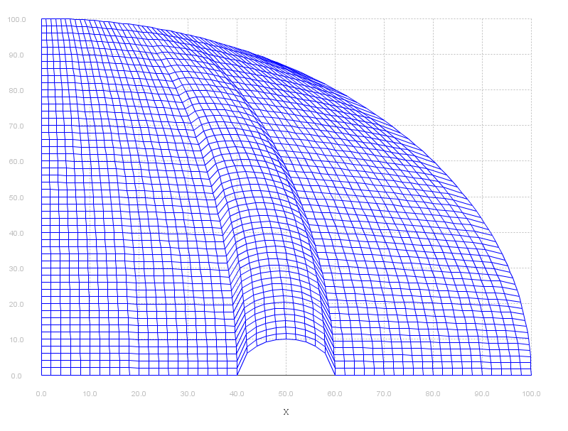

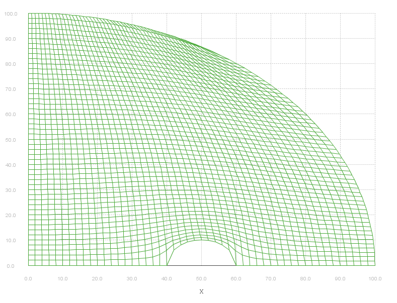

Mesh Quality report for 2 X 2 resolution
----------------------------------------

-   Initial (Transfinite interpolation)

    -   Boundary Angles

        -   The standard deviation of all boundary angles is:
            1.6913003493993906$^{\circ}$

        -   The mean boundary angle is: 95.47273957497313$^{\circ}$

        -   The maximum deviation of all angles from 90$^{\circ}$ on the
            boundary is: 63.2461081175267$^{\circ}$

        -   The corresponding angle is: 26.753891882473297$^{\circ}$ and
            is located at position: [0,16]

        -   The percent of angles within 10$^{\circ}$ of 90$^{\circ}$ on
            the boundary is: 57.6530612244898 %

    -   Interior angles

        -   The standard deviation of all interior angles is:
            0.5182833312075722$^{\circ}$

        -   The mean interior angle is: 93.08632549460636$^{\circ}$

        -   The maximum deviation of all angles from 90$^{\circ}$ on the
            interior is: 62.829524417793834$^{\circ}$

        -   The corresponding angle is: 27.17047558220617$^{\circ}$ and
            is located at position: [1,16]

        -   The percent of angles within 10$^{\circ}$ of 90$^{\circ}$ on
            the interior is: 51.770095793419415 %

    -   Aspect ratio

        -   The average aspect ratio of all cells is: 1.3872556063719226

        -   The standard deviation of all aspect ratios is:
            0.5090135522422773

-   Final( Elliptic PDE solution )

    Completed in 54 iterations

    -   Boundary Angles

        -   The standard deviation of all boundary angles is:
            2.578732547131888$^{\circ}$

        -   The mean boundary angle is: 93.07141464775451$^{\circ}$

        -   The maximum deviation of all angles from 90$^{\circ}$ on the
            boundary is: 53.15052220555345$^{\circ}$

        -   The corresponding angle is: 36.84947779444655$^{\circ}$ and
            is located at position: [0, 8] The percent of angles within
            10 deg of 90$^{\circ}$ on the boundary is: 56.25 %

    -   Interior Angles

        -   The standard deviation of all interior angles is:
            0.8789846429198418$^{\circ}$

        -   The mean interior angle is: 95.4981186288393$^{\circ}$

        -   The maximum deviation of all angles from 90$^{\circ}$ on the
            interior is: 36.63218456011564$^{\circ}$

        -   The corresponding angle is: 53.36781543988436$^{\circ}$ and
            is located at position: [1, 8] The percent of angles within
            10$^{\circ}$ of 90$^{\circ}$ on the interior is:
            55.729166666666664 %

    -   Aspect ratios

        -   The average aspect ratio of all cells is: 1.423311852960875

        -   The standard deviation of all aspect ratios is:
            0.3527840284371575

Conclusion
==========

The overall code takes less than 60 to 90 seconds to complete for a grid
size of 100 X 100. The code is available in
<https://drive.google.com/drive/folders/1U3yX2MTPRi4IPsgqF_tQLkUXxwFiET2J?usp=sharing>

References
==========

-   Sreenivas Jayanthi Computational Fluid Dynamics for Engineers and
    Scientists: Springer.

-   Farrashkhalvat, M., and J. P. Miles. Basic structured grid
    generation with an introduction to unstructured grid generation.
    Oxford: Butterworth Heinemann, 2003. Print.

-   Versteeg, H.K, and W. Malalasekera. An introduction to computational
    fluid dynamics: the finite volume method. Harlow: Pearson Education,
    2011. Print.

-   Knupp, Patrick M., and Stanly Steinberg. Fundamentals of grid
    generation. Boca Raton: CRC Press, 1994. Print.

